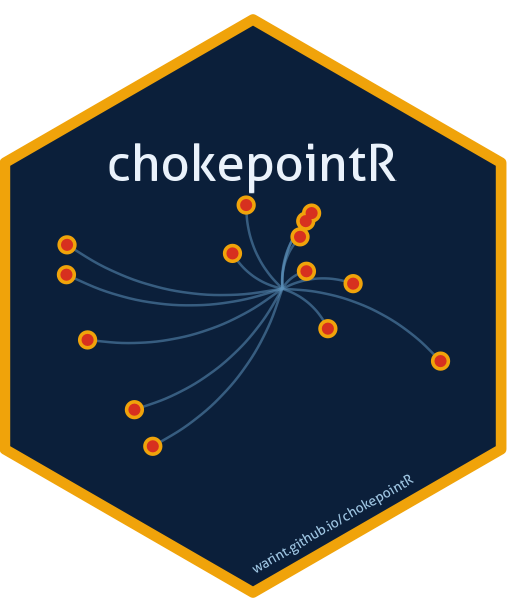

<!-- README.md is generated from README.Rmd. Please edit that file, then run devtools::build_readme() -->

```{r, include = FALSE}
knitr::opts_chunk$set(
  collapse = TRUE, comment = "#>", fig.path = "man/figures/README-",
  out.width = "100%", dpi = 130, message = FALSE, warning = FALSE
)
library(chokepointR)
```

# chokepointR 

<!-- badges: start -->
[](https://lifecycle.r-lib.org/articles/stages.html#maturing)
[](https://opensource.org/licenses/MIT)
<!-- badges: end -->

**Disruption risk and resilience of the world's maritime trade chokepoints.**

A large share of seaborne trade — and most seaborne oil — must pass through a
handful of maritime **chokepoints**: canals like Suez and Panama, straits like
Hormuz, Malacca, Bab el-Mandeb, Gibraltar, the Turkish Straits and Dover. When
one is disrupted, the shock propagates through global value chains.
`chokepointR` profiles the **resilience** of these 8 chokepoints — how much
world trade depends on each, how substitutable it is, its position in the
country–chokepoint dependency network, and what has actually gone wrong there —
and turns it into transparent resilience and vulnerability indices. Every figure
is real and cited: there is no synthetic or placeholder data.

## Installation

```{r, eval = FALSE}
# install.packages("devtools")
devtools::install_github("warint/chokepointR")
```

## The resilience picture

`cp_resilience()` returns the profile; the composite **vulnerability index**
combines how much is at stake (trade value, dependent countries, systemic risk)
with how few alternatives exist.

```{r}
library(chokepointR)
cp_resilience()[, c("location", "trade_value_bn_usd", "n_dependent_countries",
                    "resilience_index", "vulnerability_index")]
```

```{r vulnerability, echo = FALSE, eval = requireNamespace("ggplot2", quietly=TRUE), fig.height = 3.8}
library(ggplot2)
d <- cp_resilience()
ggplot(d, aes(x = reorder(location, vulnerability_index), y = vulnerability_index,
              fill = resilience_index)) +
  geom_col(width = 0.72) +
  geom_text(aes(label = vulnerability_index), hjust = -0.25, size = 3.3,
            colour = "grey30") +
  coord_flip() +
  scale_fill_gradient(low = "#d7301f", high = "#2ca25f", name = "Resilience") +
  scale_y_continuous(expand = expansion(mult = c(0, 0.10))) +
  labs(title = "Chokepoint vulnerability (higher = high stakes, few alternatives)",
       x = NULL, y = "Vulnerability index (0-100)") +
  theme_minimal(base_size = 11) +
  theme(panel.grid.major.y = element_blank(), panel.grid.minor = element_blank())
```

The index is a **transparent, equally-weighted default** — every component
score (`importance_score`, `dependency_score`, `systemic_risk_score`,
`redundancy_score`, `exposure_score`) ships in the data so you can re-weight it.

## Network centrality

Beyond raw size, `cp_resilience()` reports a panel of **six graph-theory
indicators** of each chokepoint's position in the real, weighted country–chokepoint
trade-dependency network (computed from Verschuur & Hall 2025): unweighted and
weighted betweenness (*brokerage*), degree and weighted strength (*breadth* vs.
*mass* of dependence), harmonic centrality (*reachability*) and PageRank
(*recursive influence*). Centrality captures something oil volume does not:
Hormuz carries a fifth of the world's oil yet brokers few country pairs, while
**Gibraltar and Malacca** are the network's true bottlenecks.

```{r}
cp_resilience()[, c("location", "betweenness_centrality", "betweenness_weighted",
                    "strength_weighted", "pagerank")]
```

The **[Methodology article](https://warint.github.io/chokepointR/articles/methodology.html)**
defines each measure, states the weighting, and reports a threshold-sensitivity
check (the weighted rankings are robust; the unweighted ones are ordinal).

## Quantitative context, fully sourced

`cp_context()` adds a per-chokepoint profile — vessel transits, cargo and vessel
mix, trade shares, top users, local economic dependence and rerouting cost:

```{r}
cp_context(locations = "Suez")[, c("location", "daily_transits",
                                   "primary_cargo", "top_users")]
```

Every figure is traceable through `cp_sources()`, with a `confidence` flag so
you can keep only authoritative numbers:

```{r}
head(cp_sources(min_confidence = "High")[, c("location", "variable", "value",
                                             "source")], 4)
```

Transit counts are **normal-year** figures; always read `transit_basis` before
comparing them across chokepoints (see the *Methodology* article). Crisis
magnitudes live in `chokepoint_risks`.

## Dataset at a glance

```{r glance, include = FALSE}
ry <- range(as.integer(substr(chokepoint_risks$incident_year, 1, 4)))
```

`chokepointR` bundles six maritime datasets — all real, all cited:

| Dataset | Rows | What it is |
|---|---:|---|
| `chokepoint_resilience` | `r nrow(chokepoint_resilience)` | resilience profile, six graph-theory centrality indicators + composite indices |
| `chokepoint_context` | `r nrow(chokepoint_context)` | quantitative traffic/cargo/economic profile |
| `chokepoint_sources` | `r nrow(chokepoint_sources)` | per-figure citations (source, URL, confidence) |
| `chokepoint_risks` | `r nrow(chokepoint_risks)` | documented disruption incidents (`r ry[1]`–`r ry[2]`) |
| `chokepoints` | `r nrow(chokepoints)` | reference metadata (type, region, coordinates) |
| `risk_types` | `r nrow(risk_types)` | risk taxonomy (11 risks in 3 categories) |

## Explore the incidents

Search in plain language — `cp_search()` ranks the matches:

```{r}
cp_search("drought Panama")[, c("location", "incident_year", "incident")]
```

Filter with `cp_data()`, or map with `cp_map()` (interactive **leaflet**):

```{r, eval = FALSE}
cp_data(locations = "Strait of Hormuz")
cp_map(category = "Security and conflict risk")
```

## Reference framework

**8 maritime chokepoints:** Panama Canal, Suez Canal, Strait of Hormuz, Bab
el-Mandeb, Malacca, Gibraltar, Turkish Straits, Dover Strait.

**11 risks in 3 categories:**

```{r, echo = FALSE, results = "asis"}
r <- cp_risk(); r <- r[order(r$risk_category, r$risk), ]
knitr::kable(r, row.names = FALSE, col.names = c("Risk", "Category", "Code"))
```

## Data provenance

`chokepointR` ships **facts with attribution**, not any source's copyrighted
text. Trade-dependency, systemic-risk and network-centrality measures build on
Verschuur & Hall (2025, *Nature Communications*; data CC BY 4.0); oil-transit
figures are from the U.S. Energy Information Administration (public domain);
context figures and incidents are compiled with per-row citations and a
confidence flag. Sources whose terms bar redistribution are never bundled. Full
notes are in `DATA-PROVENANCE.md`, and the **[Methodology
article](https://warint.github.io/chokepointR/articles/methodology.html)**
documents every definition, the index construction and the centrality network
for use in academic work.

## Citation

```{r}
citation("chokepointR")
```
