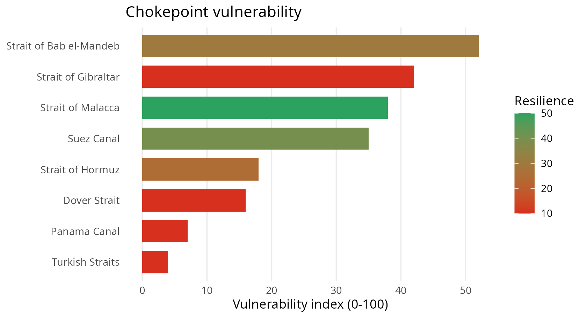
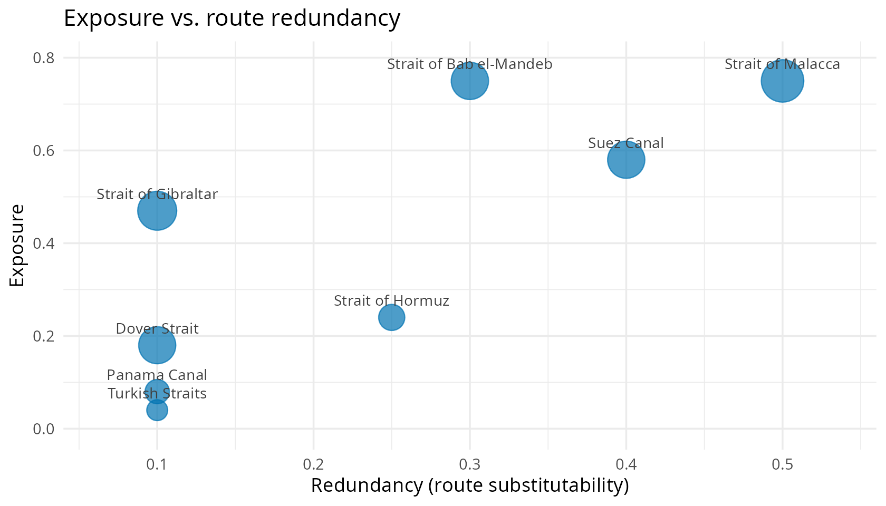

# Getting started with chokepointR

## What is `chokepointR`?

A large share of seaborne trade — and most seaborne oil — must pass
through a handful of maritime **chokepoints**: canals such as Suez and
Panama, and straits such as Hormuz, Malacca, Bab el-Mandeb, Gibraltar,
the Turkish Straits and Dover. When one is disrupted, the shock
propagates through global value chains.

`chokepointR` profiles the **resilience** of these 8 chokepoints. It
answers:

> *How much does world trade depend on each chokepoint, how
> substitutable is it, what has actually gone wrong there — and how
> vulnerable does that make it?*

It is not a measure of global value chains themselves; it supplies the
**risk / resilience layer** that supply-chain and GVC analysis needs.

## Dataset at a glance

``` r
library(chokepointR)
c(resilience = nrow(chokepoint_resilience),
  incidents  = nrow(chokepoint_risks),
  chokepoints = nrow(chokepoints),
  risk_types  = nrow(risk_types))
#>  resilience   incidents chokepoints  risk_types 
#>           8          15           8          11

# incident coverage and period
range(as.integer(substr(chokepoint_risks$incident_year, 1, 4)))
#> [1] 2019 2025
table(chokepoint_risks$risk_category)
#> 
#> Political and institutional risk       Security and conflict risk 
#>                                6                                7 
#>         Weather and climate risk 
#>                                2
```

## The resilience profile

[`cp_resilience()`](https://warint.github.io/chokepointR/reference/cp_resilience.md)
returns one row per chokepoint with importance, dependency,
systemic-risk and redundancy measures, plus two composite indices.

``` r
cp_resilience()[, c("location", "trade_value_bn_usd", "n_dependent_countries",
                    "evtd_bn_usd", "resilience_index", "vulnerability_index")]
#>                  location trade_value_bn_usd n_dependent_countries evtd_bn_usd
#> 1 Strait of Bab el-Mandeb             1858.5                    45        4.16
#> 2     Strait of Gibraltar             2035.6                    52        0.06
#> 3       Strait of Malacca             2428.5                    52        1.07
#> 4              Suez Canal             1850.3                    44        2.07
#> 5        Strait of Hormuz              885.1                    18        0.46
#> 6            Dover Strait             1836.2                    22        0.00
#> 7            Panama Canal              759.6                    15        0.56
#> 8         Turkish Straits              551.1                    15        0.17
#>   resilience_index vulnerability_index
#> 1               30                  52
#> 2               10                  42
#> 3               50                  38
#> 4               40                  35
#> 5               25                  18
#> 6               10                  16
#> 7               10                   7
#> 8               10                   4
```

**How the indices are built (transparent, equally-weighted default):**

- `importance_score` blends normalised maritime trade value and oil
  transit.
- `exposure_score` = mean of importance, dependency and systemic-risk
  scores.
- `resilience_index` = `100 * redundancy_score` (route
  substitutability).
- `vulnerability_index` =
  `100 * exposure_score * (1 - redundancy_score)` — high stakes with few
  alternatives.

All component scores ship in the data, so you can re-weight them for
your own definition of resilience.



Plotting exposure against redundancy shows the two forces behind the
index — the top-left (high exposure, low redundancy) is where systemic
risk concentrates.



## Explore the incidents

The `chokepoint_risks` log records documented disruptions. Search in
plain language:

``` r
cp_search("drought Panama")[, c("location", "incident_year", "incident")]
#>       location incident_year
#> 1 Panama Canal          2023
#> 2 Panama Canal       2023-24
#>                                                                                                                                                                                               incident
#> 1                               A severe El Nino drought forced the Panama Canal Authority to cut daily transits to about 32 ships by August 2023, producing a backlog of roughly 115 waiting vessels.
#> 2 Record-low water in Gatun Lake pushed the canal to reduce daily crossings to 24 from 7 November 2023 with tightened draft limits before rains allowed transit slots to be raised again through 2024.
```

Filter on any dimension with
[`cp_data()`](https://warint.github.io/chokepointR/reference/cp_data.md):

``` r
cp_data(locations = "Strait of Bab el-Mandeb")[, c("incident_year", "risk", "incident")]
#>   incident_year     risk
#> 1          2023 Conflict
#> 2          2024 Conflict
#> 3          2024 Conflict
#> 4          2024 Conflict
#> 5          2025 Conflict
#>                                                                                                                                                                                                                                   incident
#> 1                                                              Houthi forces used a helicopter to board and seize the vehicle carrier Galaxy Leader in the southern Red Sea on 19 November 2023, holding its 25 crew for more than a year.
#> 2                                                                 The fertiliser-laden bulk carrier Rubymar, struck by a Houthi missile on 18 February 2024, sank on 2 March 2024, becoming the first vessel lost in the Red Sea campaign.
#> 3                                                               A Houthi anti-ship missile struck the bulk carrier True Confidence in the Gulf of Aden on 6 March 2024, killing three seafarers in the first fatal attack of the campaign.
#> 4 The Greek-flagged crude tanker Sounion, carrying nearly one million barrels of oil, was set ablaze and disabled by projectiles near Hodeidah on 21 August 2024 in an attack attributed to Houthi forces, raising fears of a major spill.
#> 5                                             Houthi forces sank the bulk carriers Magic Seas and Eternity C in the Red Sea in early July 2025, killing at least three crew and taking others captive in a sharp re-escalation of attacks.
```

Map them in one call (interactive **leaflet**, coloured by risk level):

``` r
cp_map(category = "Security and conflict risk")
```

## Reference: the risk taxonomy

| Risk                       | Risk Category                    | Risk Code |
|:---------------------------|:---------------------------------|:----------|
| Temperature extremes       | Weather and climate risk         | W-T       |
| Flood and drought          | Weather and climate risk         | W-F/D     |
| Storms                     | Weather and climate risk         | W-S       |
| Haze and fog               | Weather and climate risk         | W-H/F     |
| Conflict                   | Security and conflict risk       | S-C       |
| Terrorist attack           | Security and conflict risk       | S-T       |
| Piracy                     | Security and conflict risk       | S-P       |
| Cyberattack                | Security and conflict risk       | S-C/A     |
| Trade and transit controls | Political and institutional risk | P-T       |
| Disrepair                  | Political and institutional risk | P-D       |
| Unforced delays            | Political and institutional risk | P-U       |

## Live hazard signals (optional)

[`cp_signals()`](https://warint.github.io/chokepointR/reference/cp_signals.md)
fetches recent natural-hazard events (public-domain USGS earthquake
data) near a chokepoint. It needs an internet connection and returns
`NULL` when offline.

``` r
cp_signals("Strait of Hormuz", days = 90, min_magnitude = 4.5)
```

## Data, provenance and citation

`chokepointR` ships **facts** with attribution. Trade-dependency and
systemic-risk measures build on Verschuur & Hall (2025, *Nature
Communications*; data CC BY 4.0); oil transit is from the U.S. EIA
(public domain); incidents carry per-row citations. See
`DATA-PROVENANCE.md` for full notes.

``` r
citation("chokepointR")
#> To cite the chokepointR package in publications, please use:
#> 
#>   Warin, Thierry (2026). chokepointR: Global Trade Chokepoint Risks and
#>   Resilience. R package version 0.4.0.
#>   https://github.com/warint/chokepointR
#> 
#> A BibTeX entry for LaTeX users is
#> 
#>   @Manual{,
#>     title = {chokepointR: Global Trade Chokepoint Risks and Resilience},
#>     author = {Thierry Warin},
#>     year = {2026},
#>     note = {R package version 0.4.0},
#>     url = {https://github.com/warint/chokepointR},
#>   }
#> 
#> The resilience profile's trade-dependency, systemic-risk and network-
#> centrality measures are computed from Verschuur & Hall (2025),
#> 'Maritime chokepoint dependencies and systemic risks', Nature
#> Communications; data on Zenodo (CC BY 4.0),
#> doi:10.5281/zenodo.13841881.  Please cite that work as well when using
#> those columns.
```
