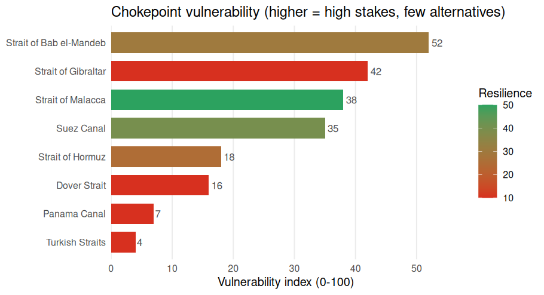

# chokepointR

**Disruption risk and resilience of the world’s maritime trade
chokepoints.**

A large share of seaborne trade — and most seaborne oil — must pass
through a handful of maritime **chokepoints**: canals like Suez and
Panama, straits like Hormuz, Malacca, Bab el-Mandeb, Gibraltar, the
Turkish Straits and Dover. When one is disrupted, the shock propagates
through global value chains. `chokepointR` profiles the **resilience**
of these 8 chokepoints — how much world trade depends on each, how
substitutable it is, its position in the country–chokepoint dependency
network, and what has actually gone wrong there — and turns it into
transparent resilience and vulnerability indices. Every figure is real
and cited: there is no synthetic or placeholder data.

## Installation

``` r
# install.packages("devtools")
devtools::install_github("warint/chokepointR")
```

## The resilience picture

[`cp_resilience()`](https://warint.github.io/chokepointR/reference/cp_resilience.md)
returns the profile; the composite **vulnerability index** combines how
much is at stake (trade value, dependent countries, systemic risk) with
how few alternatives exist.

``` r
library(chokepointR)
cp_resilience()[, c("location", "trade_value_bn_usd", "n_dependent_countries",
                    "resilience_index", "vulnerability_index")]
#>                  location trade_value_bn_usd n_dependent_countries
#> 1 Strait of Bab el-Mandeb             1858.5                    45
#> 2     Strait of Gibraltar             2035.6                    52
#> 3       Strait of Malacca             2428.5                    52
#> 4              Suez Canal             1850.3                    44
#> 5        Strait of Hormuz              885.1                    18
#> 6            Dover Strait             1836.2                    22
#> 7            Panama Canal              759.6                    15
#> 8         Turkish Straits              551.1                    15
#>   resilience_index vulnerability_index
#> 1               30                  52
#> 2               10                  42
#> 3               50                  38
#> 4               40                  35
#> 5               25                  18
#> 6               10                  16
#> 7               10                   7
#> 8               10                   4
```



The index is a **transparent, equally-weighted default** — every
component score (`importance_score`, `dependency_score`,
`systemic_risk_score`, `redundancy_score`, `exposure_score`) ships in
the data so you can re-weight it.

## Network centrality

Beyond raw size,
[`cp_resilience()`](https://warint.github.io/chokepointR/reference/cp_resilience.md)
reports a panel of **six graph-theory indicators** of each chokepoint’s
position in the real, weighted country–chokepoint trade-dependency
network (computed from Verschuur & Hall 2025): unweighted and weighted
betweenness (*brokerage*), degree and weighted strength (*breadth*
vs. *mass* of dependence), harmonic centrality (*reachability*) and
PageRank (*recursive influence*). Centrality captures something oil
volume does not: Hormuz carries a fifth of the world’s oil yet brokers
few country pairs, while **Gibraltar and Malacca** are the network’s
true bottlenecks.

``` r
cp_resilience()[, c("location", "betweenness_centrality", "betweenness_weighted",
                    "strength_weighted", "pagerank")]
#>                  location betweenness_centrality betweenness_weighted
#> 1 Strait of Bab el-Mandeb                 0.1318               0.0842
#> 2     Strait of Gibraltar                 0.2337               0.3895
#> 3       Strait of Malacca                 0.1982               0.2405
#> 4              Suez Canal                 0.1170               0.1213
#> 5        Strait of Hormuz                 0.0070               0.0192
#> 6            Dover Strait                 0.0879               0.0920
#> 7            Panama Canal                 0.0920               0.1180
#> 8         Turkish Straits                 0.0170               0.0219
#>   strength_weighted pagerank
#> 1             29.53   0.0520
#> 2             32.72   0.0604
#> 3             30.58   0.0572
#> 4             27.75   0.0490
#> 5              9.88   0.0172
#> 6             16.04   0.0307
#> 7              9.92   0.0280
#> 8             11.48   0.0206
```

The **[Methodology
article](https://warint.github.io/chokepointR/articles/methodology.html)**
defines each measure, states the weighting, and reports a
threshold-sensitivity check (the weighted rankings are robust; the
unweighted ones are ordinal).

## Quantitative context, fully sourced

[`cp_context()`](https://warint.github.io/chokepointR/reference/cp_context.md)
adds a per-chokepoint profile — vessel transits, cargo and vessel mix,
trade shares, top users, local economic dependence and rerouting cost:

``` r
cp_context(locations = "Suez")[, c("location", "daily_transits",
                                   "primary_cargo", "top_users")]
#>     location daily_transits
#> 1 Suez Canal             72
#>                                                                                  primary_cargo
#> 1 Containerized manufactures (Asia-Europe), crude & refined products, LNG, dry bulk, vehicles.
#>                                                         top_users
#> 1 Asia-Europe carriers (Maersk, MSC, CMA CGM); operated by Egypt.
```

Every figure is traceable through
[`cp_sources()`](https://warint.github.io/chokepointR/reference/cp_sources.md),
with a `confidence` flag so you can keep only authoritative numbers:

``` r
head(cp_sources(min_confidence = "High")[, c("location", "variable", "value",
                                             "source")], 4)
#>       location        variable                                        value
#> 1 Panama Canal annual_transits 9944 (FY2024 drought); ~13,000-14,000 normal
#> 2 Panama Canal  daily_transits        36 normal; ~24 during 2023-24 drought
#> 3 Panama Canal    toll_revenue                                          5.0
#> 4   Suez Canal annual_transits            26434 (2023 record); 13213 (2024)
#>                                source
#> 1        Panama Canal Authority (ACP)
#> 2                            U.S. EIA
#> 3        Panama Canal Authority (ACP)
#> 4 Suez Canal Authority (via Statista)
```

Transit counts are **normal-year** figures; always read `transit_basis`
before comparing them across chokepoints (see the *Methodology*
article). Crisis magnitudes live in `chokepoint_risks`.

## Dataset at a glance

`chokepointR` bundles six maritime datasets — all real, all cited:

| Dataset                 | Rows | What it is                                                                     |
|-------------------------|-----:|--------------------------------------------------------------------------------|
| `chokepoint_resilience` |    8 | resilience profile, six graph-theory centrality indicators + composite indices |
| `chokepoint_context`    |    8 | quantitative traffic/cargo/economic profile                                    |
| `chokepoint_sources`    |   45 | per-figure citations (source, URL, confidence)                                 |
| `chokepoint_risks`      |   15 | documented disruption incidents (2019–2025)                                    |
| `chokepoints`           |    8 | reference metadata (type, region, coordinates)                                 |
| `risk_types`            |   11 | risk taxonomy (11 risks in 3 categories)                                       |

## Explore the incidents

Search in plain language —
[`cp_search()`](https://warint.github.io/chokepointR/reference/cp_search.md)
ranks the matches:

``` r
cp_search("drought Panama")[, c("location", "incident_year", "incident")]
#>       location incident_year
#> 1 Panama Canal          2023
#> 2 Panama Canal       2023-24
#>                                                                                                                                                                                               incident
#> 1                               A severe El Nino drought forced the Panama Canal Authority to cut daily transits to about 32 ships by August 2023, producing a backlog of roughly 115 waiting vessels.
#> 2 Record-low water in Gatun Lake pushed the canal to reduce daily crossings to 24 from 7 November 2023 with tightened draft limits before rains allowed transit slots to be raised again through 2024.
```

Filter with
[`cp_data()`](https://warint.github.io/chokepointR/reference/cp_data.md),
or map with
[`cp_map()`](https://warint.github.io/chokepointR/reference/cp_map.md)
(interactive **leaflet**):

``` r
cp_data(locations = "Strait of Hormuz")
cp_map(category = "Security and conflict risk")
```

## Reference framework

**8 maritime chokepoints:** Panama Canal, Suez Canal, Strait of Hormuz,
Bab el-Mandeb, Malacca, Gibraltar, Turkish Straits, Dover Strait.

**11 risks in 3 categories:**

| Risk                       | Category                         | Code  |
|:---------------------------|:---------------------------------|:------|
| Disrepair                  | Political and institutional risk | P-D   |
| Trade and transit controls | Political and institutional risk | P-T   |
| Unforced delays            | Political and institutional risk | P-U   |
| Conflict                   | Security and conflict risk       | S-C   |
| Cyberattack                | Security and conflict risk       | S-C/A |
| Piracy                     | Security and conflict risk       | S-P   |
| Terrorist attack           | Security and conflict risk       | S-T   |
| Flood and drought          | Weather and climate risk         | W-F/D |
| Haze and fog               | Weather and climate risk         | W-H/F |
| Storms                     | Weather and climate risk         | W-S   |
| Temperature extremes       | Weather and climate risk         | W-T   |

## Data provenance

`chokepointR` ships **facts with attribution**, not any source’s
copyrighted text. Trade-dependency, systemic-risk and network-centrality
measures build on Verschuur & Hall (2025, *Nature Communications*; data
CC BY 4.0); oil-transit figures are from the U.S. Energy Information
Administration (public domain); context figures and incidents are
compiled with per-row citations and a confidence flag. Sources whose
terms bar redistribution are never bundled. Full notes are in
`DATA-PROVENANCE.md`, and the **[Methodology
article](https://warint.github.io/chokepointR/articles/methodology.html)**
documents every definition, the index construction and the centrality
network for use in academic work.

## Citation

``` r
citation("chokepointR")
#> To cite the chokepointR package in publications, please use:
#> 
#>   Warin, Thierry (2026). chokepointR: Global Trade Chokepoint Risks and
#>   Resilience. R package version 0.4.0.
#>   https://github.com/warint/chokepointR
#> 
#> A BibTeX entry for LaTeX users is
#> 
#>   @Manual{,
#>     title = {chokepointR: Global Trade Chokepoint Risks and Resilience},
#>     author = {Thierry Warin},
#>     year = {2026},
#>     note = {R package version 0.4.0},
#>     url = {https://github.com/warint/chokepointR},
#>   }
#> 
#> The resilience profile's trade-dependency, systemic-risk and network-
#> centrality measures are computed from Verschuur & Hall (2025),
#> 'Maritime chokepoint dependencies and systemic risks', Nature
#> Communications; data on Zenodo (CC BY 4.0),
#> doi:10.5281/zenodo.13841881.  Please cite that work as well when using
#> those columns.
```
